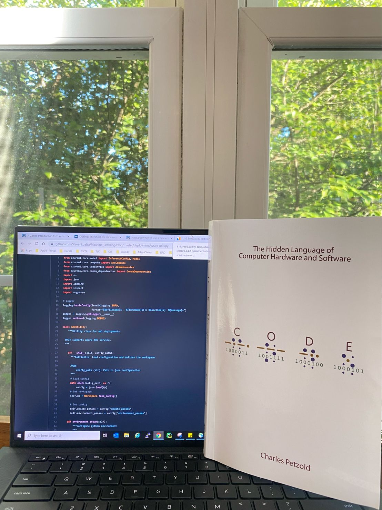
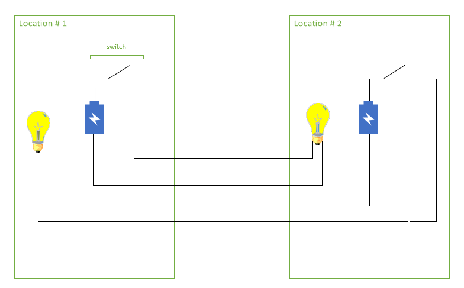
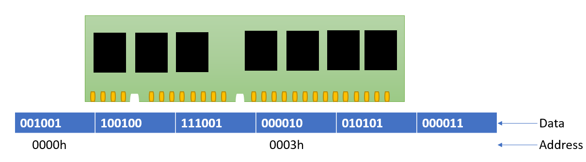

# Readings

INTRO

## Boomerang by Michael Lewis
*The investigation of bubbles beyond the United States*

Michael Lewis writes mundane topics in an interesting light. I have read The Premonition, The Undoing Project, Flash Boys, Liar’s Poker and saw films based on his writing, namely The Blind Side and The Big Short. Each of these is about economics or finance (not the most exciting topics). But somehow Michael Lewis adds a spark to the topic and brings it to life. I am now working my way back to some of his earlier work, starting with Boomerang.

*Like anything in life, moderation is key.*

Cheap credit is a wonderful thing. We would all love to borrow from the bank for our student loans, personal renovation, and housing at the lowest interest rate possible. But just because the credit is “cheap” does not equate to a heightened ability to repay the loan. Fiscal responsibility is knowing how much to borrow such that you do not become insolvent. But as we all know, credit sometimes gets the better of us and we begin to rack up debt. We saw this happen in the United States with the housing bubble.

Lewis describes an era of indulgent activities and instant gratification that was otherwise unattainable. But it was not isolated to the United States, bubbles were forming well beyond our shores. Michael Lewis set out to investigate bubbles and his journey led him to Iceland. Lewis states that “[i]n 2006 the average Icelandic family was three times as wealthy… [compared to] 2003” (pg. 2), this was tied to investment banking in the country. Accumulation of wealth is great, but not at the expense of your future self. Icelanders would go on to amass debt around 850 percent of their Gross Domestic Product and the economy would go boom by 2008.

To gain access to cheap credit, people all-out lied. The Greek government in particular would omit high-priced items from their measurement of the consumer price index (CPI). They also “lower[ed] the budget deficit … [by moving] expenses off the books” (pg. 61). This allowed them to enter the European Monetary Union and borrow at lower interest rates. What did the countries, and consumers, in particular, do with this influx of capital? Icelanders took advantage of the interest rate arbitrage, between their currency and foreign monies. In Ireland new housing development boomed, but “there were never enough people in Ireland to fill the new houses” (pg. 121). This last point highlights the main problem with debt, that if it does not have returns then how will the creditors be paid?

Apart from the dense metrics above, we also get some funny stories in the reading. Lewis highlights Germany’s positive disposition towards feces. He goes on to explain that Hitler’s doctors spent time examining his feces and that there is evidence in favor of his sexual preference toward feces. As a literary, this all ties back to the main story of the debt crisis. It leads to his point that “Germany longed to be near the shit, but not in it” a visual representation of their role in the European financial crisis.

Everyone kept partying even though the music stopped, the lights went out, and the building was on fire. Consumers had a delusional optimism that the “good times” were perpetual and that there was no limit. After the money is spent, the creditor comes knocking for their repayment. The governments are unable to pay their debts because the public is evading taxes by misrepresenting their income (pg. 51) and why bother realizing the losses when the government will rescue you (pg 105, 113). The problem runs deeper than this, and the chapters have a way of telling a story that is both informative and interesting.

## Understanding how computers work
*Code by Charles Petzold gives us a better appreciation for computers by building one from scratch.*

Back in June, I was developing a scoring pipeline for a machine learning model that would be placed into production. As with many real-time modeling applications, there is a client that is expecting a response and thus there are latency requirements. This meant that the pipeline would have an upper limit of 750ms, yes milliseconds. I needed to speed up the computations and minimize memory usage. After spending weeks on the task, we clocked the run below 300ms.

This task made me appreciate the engineering, usage of native python data structure, and memory. Memory played a big role in reducing the computation speed of the script. With all this complexity I began to wonder about the foundation of computing and how it all actually works?

Although it took 16 chapters to reach memory Charles Petzold’s Code, takes the reader through a well-organized journey. I will say this is not the most interesting topic, and knowing more won't help in your everyday use of computers. It took me three weeks to finish and at times I felt like giving up (especially with Hexa-decimals and following Logic Gates) but as Petzold states, “With sophistication comes complexity, so some of this might be rough going. No one will blame you if you skim over the excruciating details” [pg. 206].

After reading you will come away with a much better understanding and respect for a computer.
Much of the first few chapters are dedicated to simple machines and communication systems. I use the term “simple” loosely because these concepts and inventions were ahead of their time during their development.

The book starts off with an interesting story of two best friends that want to communicate, without the use of cellphones, the internet, or other devices. As many would guess, the best friends use a tool to communicate, the flashlight. Through this tale, we learn about morse code, braille, binary code( the very essence of a computer), and how to build a flashlight. The story deepens when one of the friends moves away. This leads to, conceptually, building a Bidirectional telegraph system with the use of a few items (batteries, wires, and lightbulb).

The concept is straightforward. The system must convert light patterns to written language much like Morse code. Let's discuss the flow of our telegraph system.
For any of the bulbs to light up the circuit must be closed via the switch. This serves as the input of the communication system. Leaving the switch closed for half a second can signal a dot while 3 seconds is a dash. And a pre-defined set of dots and dashes equates to a letter. And you see the pattern, a tedious and often time-consuming task creates a communication system between two parties.

This machine only has two positions, on/off. Communication, and in general computing, requires more complicated logic. Charles does a great job explaining the use of logic gates and visually demonstrating how it can create complicated logic. Logic gates are an important takeaway from the concepts of computing.

After the logic for I/O is complete, it must be stored. Think about the task of adding three numbers together. The first two numbers are added, the intermediate value is stored, then the third number is added to get the final result. Random Access Memory allows the computer to store the intermediate value for later use. RAM allocates space to hold data that can be retrieved by knowing its storage location address and it is processed quickly compared to reading from the hard drive.

I won't go into detail on the mechanics of how a circuit holds data, Charles has done a wonderful job of explaining the concept. Although chapter 16 is dedicated to RAM, it is chapter 14 Feedback and Flip-Flops where he explains how a circuit remembers.

The book starts off strong and grabs the reader's attention, although it may falter when it comes to hexadecimal and logic gates. I encourage you to skim through the chapters requiring too much focus and instead grasp the general concepts. Once you are done and would like to dig into the details you can review them again.

